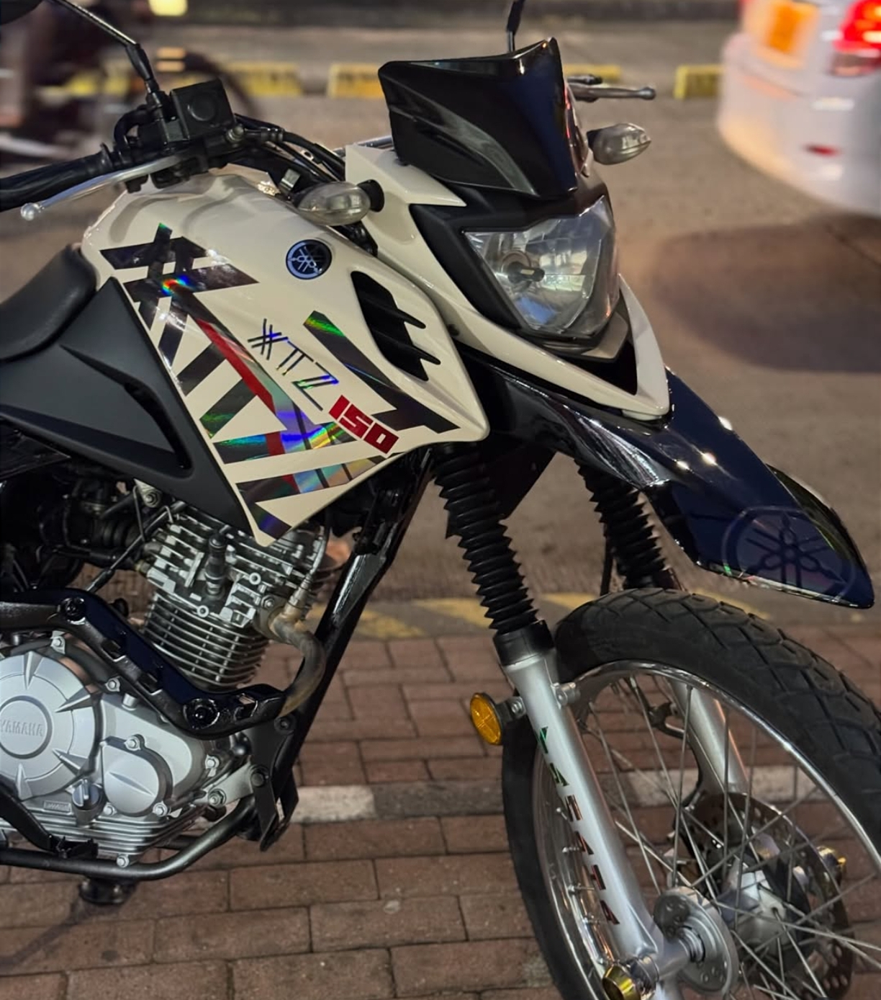

# MotoGrafix — Landing page

Landing page para el taller de **wrapping, vinilos y calcomanías** MotoGrafix
(Cali, Valle del Cauca). Sus dos funciones principales son **agendar citas** y
**mostrar trabajos realizados**.

## Estructura

```
motografix/
├── index.html
├── assets/
│   ├── css/styles.css
│   ├── js/main.js
│   └── img/
│       ├── logo-motografix.png          ← logo horizontal (barra superior)
│       ├── logo-motografix-stacked.png  ← logo apilado (footer)
│       └── favicon.svg
└── README.md
```

Abre `index.html` en el navegador. No necesita build ni dependencias.

---

## Datos del negocio configurados

- **Dirección:** Carrera 15 # 49-72, Barrio Chapineros, Cali, Valle del Cauca — Colombia
- **Horario:** lunes a sábado, jornada continua de 9:30 a.m. a 6:30 p.m.
- **Cerrado:** domingos y días festivos
- **WhatsApp:** 324 383 6054 (`573243836054` en formato internacional)
- **Instagram:** [@motografix02](https://www.instagram.com/motografix02)
- **TikTok:** [@moto.grafix](https://www.tiktok.com/@moto.grafix)
- **Marcas que atendemos:** Yamaha, AKT, Honda, Victory, Suzuki, Bajaj, KTM, BMW, Hero, Voge

Las marcas van en la franja deslizante bajo el hero (`<section class="marquee">` en
`index.html`). Para agregar o quitar una, edítala **en los dos bloques de `<span>`**:
la lista está duplicada a propósito para que el desplazamiento sea continuo, y las
dos mitades deben ser idénticas.

Si el número cambia, hay que tocarlo en dos sitios: `CONFIG.whatsapp` en
`assets/js/main.js` y los enlaces del `<footer>` en `index.html`.

## Precios (COP)

| Servicio | Precio |
|---|---|
| Wrap completo (moto) | $400.000 |
| Kit gráfico original | $90.000 |
| Kit gráfico personalizado | $160.000 |
| Calcomanías y stickers | desde $20.000 |
| PPF — moto completa | $500.000 |
| Rotulación comercial | a cotización |
| Detalles y blackout | a cotización |

Se editan en la sección `#servicios` de `index.html` (dentro de `<p class="card__price">`)
y en el `<select id="servicio">` del formulario.

---

## Cómo funciona el formulario de citas

Es 100 % del lado del cliente. Valida los campos y **bloquea automáticamente**:

- domingos,
- fechas con menos de un día de anticipación,
- fechas a más de 3 meses.

Las horas disponibles van de 9:30 a.m. a 5:30 p.m., para que el último trabajo
alcance a cerrarse antes de las 6:30 p.m.

Al enviar, arma un mensaje de WhatsApp con el resumen completo de la cita
(nombre, teléfono, vehículo, servicio, fecha, hora y notas). El cliente pulsa
**Enviar por WhatsApp** y llega al taller.

> Los festivos **no** se bloquean en el calendario: la página avisa en el FAQ y en
> el footer que no se atiende en festivos, y la cita se confirma manualmente por
> WhatsApp de todos modos.

Si más adelante quieres guardar las citas en un servidor, al final del `submit`
en `main.js` hay un bloque comentado con el `fetch()` listo para tu endpoint.

---

## Portafolio: cómo agregar un trabajo

La galería está organizada **por servicio**, no por tipo de vehículo (el taller
solo trabaja motos). Las categorías válidas de `data-cat` son:

`wrap` · `graficos` · `rines`

Deben coincidir exactamente con los `data-filter` de los botones de filtro.
Para abrir una categoría nueva (PPF, blackout…) se agrega su botón en el bloque
`<div class="filters">` y ya se puede usar ese `data-cat` en las fotos.

### 1. Guarda la foto

En `assets/img/trabajos/`. Nombre **sin espacios ni tildes**, todo en minúsculas:

```
yamaha-xtz-150-graficos-tornasol.jpeg
```

Foto **vertical (3:4)** — sirve tal cual sale del celular. Hay un `LEEME.txt` en
esa carpeta con las mismas reglas, por si alguien más sube fotos.

### 2. Pega el bloque en `index.html`

Dentro de `<div class="gallery">`:

```html
<figure class="shot" data-cat="wrap" data-brand="Yamaha">
  
  <span class="shot__brand">Yamaha</span>
  <figcaption>
    <h3>Yamaha XTZ 150</h3>
    <p>Kit gráfico en tornasol</p>
  </figcaption>
</figure>
```

Eso es todo: el filtro, la insignia de marca y el visor de fotos lo toman
automáticamente.

**No quites el `loading="lazy"`**: es lo que hace que cada foto se descargue solo
cuando el visitante llega a ella, en vez de bajar las 9 de golpe.

El `alt` no es relleno: es lo que lee Google y lo que escucha quien usa lector de
pantalla. Descríbelo como se lo contarías a alguien por teléfono.

### Peso de las fotos

Ideal por debajo de 300 KB cada una. La de la Yamaha XTZ 150 pesa 879 KB — vale
la pena pasarla por [squoosh.app](https://squoosh.app) antes de publicar el sitio.

### Visor de fotos

Al hacer clic en un trabajo se abre en grande, con la marca, el nombre y el
servicio. Se navega con las flechas ← → del teclado o los botones laterales, y se
cierra con Esc, con la ✕ o haciendo clic en el fondo. Solo recorre los trabajos
del filtro activo.

## Las fotos del hero

Las tres fotos superpuestas del encabezado (`<div class="hero__visual">`) son
**las mismas de la galería**, a propósito: el navegador las descarga una sola vez
y las reutiliza desde caché cuando el visitante llega al portafolio.

Si las cambias, usa fotos que ya estén en la galería. Si pones fotos nuevas,
sumas ese peso a la primera carga de la página, que es la que más importa.

El rojo, el amarillo y el azul de la marca siguen ahí: ahora van en las etiquetas
(`tag--red`, `tag--blue`, `tag--yellow`) en vez de en bloques de color sueltos.

## Paleta de colores

En `assets/css/styles.css`, dentro de `:root`:

```css
--red: #E5202E;    /* acento principal, CTAs — el rojo del logo */
--yellow: #FFC300; /* acento secundario, detalles */
--blue: #1B4DFF;   /* foco, enlaces, estados */
--ink: #0C0E14;    /* header, hero, galería y footer */
```

## Optimización para celulares

Puntos de quiebre: **980 px** (tablet), **760 px** (celular grande),
**560 px** (celular), **420 px** (celular pequeño), más un bloque
`@media (hover:none)` para pantallas táctiles.

Decisiones que conviene no deshacer sin querer:

- **Los campos del formulario van en `font-size:16px` exactos.** Por debajo de
  16 px, Safari en iPhone hace zoom automático al enfocar un campo y descuadra
  toda la página. Si quieres letra más chica, cambia el `padding`, no el tamaño.
- **`scroll-margin-top` en las secciones.** La barra superior es sticky; sin esa
  regla, al tocar un enlace del menú la sección aterriza escondida detrás.
- **`loading="lazy"` en las fotos del portafolio.** Ver la sección del portafolio.
- **El bloque `@media (hover:none)`.** En pantallas táctiles el `:hover` se queda
  pegado después de tocar: una tarjeta tocada se quedaba levantada. Ese bloque
  anula los efectos de mouse y, de paso, deja la lupa del portafolio siempre
  visible (en táctil nunca aparecía).
- **La galería va a 2 columnas** en celular, y los filtros se vuelven una tira
  deslizable de borde a borde en vez de apilarse en cuatro líneas.
- **En el hero, el texto va antes que las fotos** en celular, para que el titular
  y el botón de agendar se vean sin hacer scroll. Y de las tres fotos superpuestas
  queda solo una: en 340 px de ancho las otras dos ni se distinguían.
- **Visor de fotos con gestos:** deslizar a los lados cambia de foto, deslizar
  hacia abajo cierra.

## Notas

- La barra superior es oscura a propósito: el logo tiene letras blancas con
  contorno, y sobre fondo claro perdía legibilidad.
- Si alguno de los dos PNG del logo faltara, la página muestra automáticamente un
  logo de texto de respaldo en vez de romperse.
- Responsive de 320 px en adelante, con menú hamburguesa en móvil.
- Accesible: skip link, focus visible, `aria-*` en menú y filtros, respeta
  `prefers-reduced-motion`.
- Las fuentes vienen de Google Fonts (Barlow Condensed + Inter). Si necesitas que
  funcione sin internet, descárgalas a `assets/` y cambia el `<link>` del `<head>`.
